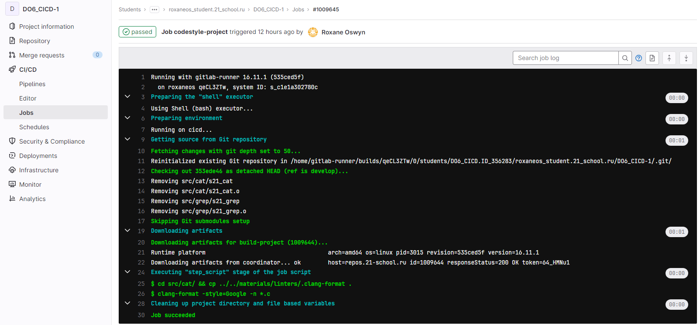

## Part 1. Настройка gitlab-runner

- Подними виртуальную машину Ubuntu Server 22.04 LTS.

- Скачай и установи на виртуальную машину gitlab-runner.

- Запусти gitlab-runner и зарегистрируй его для использования в текущем проекте (DO6_CICD).

## Part 2. Сборка

- В файле gitlab-ci.yml добавь этап запуска сборки через мейк файл из проекта C2. Файлы, полученные после сборки (артефакты), сохрани в произвольную директорию со сроком хранения 30 дней.

## Part 3. Тест кодстайла

- Напиши этап для CI, который запускает скрипт кодстайла (clang-format). Если кодстайл не прошел, то «зафейли» пайплайн. 

В пайплайне отобрази вывод утилиты clang-format.

## Part 4. Интеграционные тесты

- Напиши этап для CI, который запускает твои интеграционные тесты из того же проекта. Запусти этот этап автоматически только при условии, если сборка и тест кодстайла прошли успешно.

- Если тесты не прошли, то «зафейли» пайплайн.

- В пайплайне отобрази вывод, что интеграционные тесты успешно прошли / провалились.

## Part 5. Этап деплоя

- Подними вторую виртуальную машину Ubuntu Server 22.04 LTS.

- Напиши этап для CD, который «разворачивает» проект на другой виртуальной машине. Запусти этот этап вручную при условии, что все предыдущие этапы прошли успешно. В файле gitlab-ci.yml добавь этап запуска написанного скрипта.

- Напиши bash-скрипт, который при помощи ssh и scp копирует файлы, полученные после сборки (артефакты), в директорию /usr/local/bin второй виртуальной машины.

- Настраиваем мост с между нашим сервером и сервером для деплоя, проверяем подключение по ssh:

- В результате ты должен получить готовые к работе приложения из проекта C2_SimpleBashUtils (s21_cat и s21_grep) на второй виртуальной машине.

- Сохрани дампы образов виртуальных машин.

## Part 6. Дополнительно. Уведомления

Настрой уведомления о успешном/неуспешном выполнении пайплайна через бота с именем «[твой nickname] DO6 CI/CD» в Telegram. Создаем бота через BotFather 

- Дополняем скрипт из файла notifications.md своим токеном бота и id аккаунта.

- В .gitlab-ci.yml файле, после каждого job добавляем проверку на статус выполнения 

Текст уведомления должен содержать информацию об успешности прохождения как этапа CI, так и этапа CD.
В остальном текст уведомления может быть произвольным.

